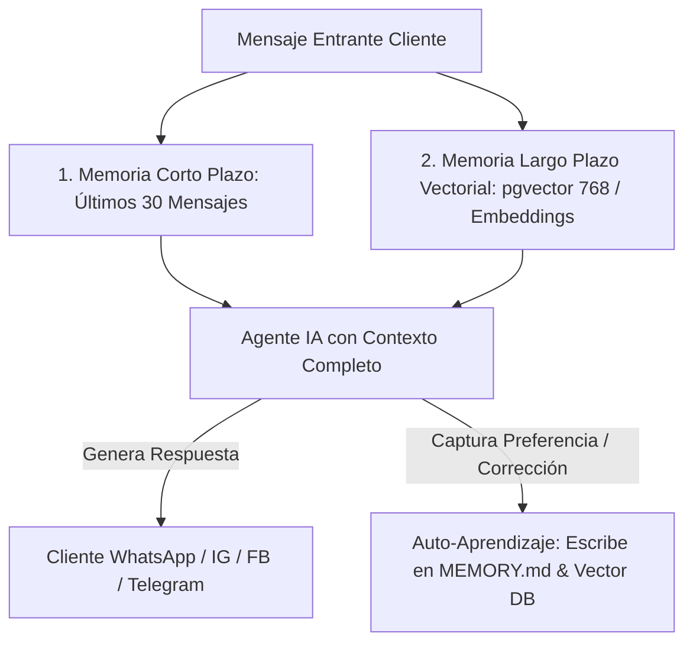

# 💬 Skill: Customer Agent Protocol & Onboarding Engine

> Esta Skill establece el **Protocolo de Atención, Onboarding, Memoria Evolutiva Doble (Corto Plazo + Largo Plazo Vectorial) y LangGraph State Machine** para **Agentes Inteligentes de RRSS** y CRMs (WhatsApp, Instagram, Telegram, Facebook, TikTok). Incorpora estándares avanzados de arquitectura (Doble Memoria `pgvector`, Auto-Aprendizaje de Preferencias, Lead Scoring Térmico y Escalado Humano).

---

## 🧠 Protocolo de Doble Memoria Persistente y Aprendizaje Evolutivo

Todo agente desarrollado o guiado por esta skill DEBE implementar de forma inmutable el sistema de **Doble Memoria**:

### 1. Memoria a Corto Plazo (Short-Term Session Memory)
* **Historial de Sesión:** `chat_sessions` vinculado al `sessionId` / `phone_number`. Mantiene presentes los últimos 30 mensajes de la conversación para eliminar el olvido de contexto e impedir preguntas repetitivas.

### 2. Memoria a Largo Plazo Vectorial (Long-Term Vector Memory - `agent_knowledge`)
* **Vectorización de Insights (`pgvector` / Embeddings):** Almacenamiento persistente en tres categorías clave:
  * `client_preference`: Gustos, presupuesto y restricciones del cliente.
  * `market_insight`: Métricas y datos de productos/servicios.
  * `interaction_learning`: Correcciones y reglas aprendidas del desarrollador (`MEMORY.md`).
* **Auto-Aprendizaje Vectorial:** Cuando el cliente o desarrollador expresa una preferencia o corrección, se genera automáticamente un embedding y se indexa en la base vectorial para recordarlo de por vida.

### 3. Registro de Errores e Histórico (`BUG_HISTORY.md`)
* **Consulta Pre-Fix:** Antes de intentar corregir un problema o bug en la lógica del bot, el agente consulta `BUG_HISTORY.md` para evitar repetir soluciones fallidas o caer en bucles.

---

## 📊 Lead Scoring Térmico Centralizado (`crm_leads`)

Clasificación dinámica del estado térmico del cliente durante la conversación:

* 🔥 **`caliente`**: Cliente solicitando agendamiento de cita, cotización directa o listo para comprar.
* 🟡 **`esperando_respuesta`**: Cliente en etapa de calificación recopilando información.
* ❄️ **`frio`**: Cliente en etapa de descubrimiento inicial.
* ⏸️ **`pausado` / `desuscrito`**: Sesión detenida por solicitud del usuario.

---

## 🎯 Protocolo de Entrevista / Onboarding (4 Preguntas Clave)

Al activar esta skill para configurar un nuevo agente o mejorar uno existente, se debe definir la siguiente matriz:

1. **💬 ¿Cómo hablar con el cliente?** (Tono, personalidad, modismos, nivel de formalidad, emojis).
2. **🎯 ¿Qué se quiere resolver?** (Ventas, soporte técnico, agendamiento de citas, calificación de leads).
3. **👥 ¿Quién es tu público objetivo?** (Buyer persona, edad, nivel técnico, dolores y expectativas).
4. **🚀 ¿Cuál es el proyecto/producto?** (Nombre comercial, propuesta de valor, límites del servicio).

---

## 📋 Reglas Inmutables del System Prompt (Cero Alucinaciones)

* **Veracidad Absoluta (Cero Alucinaciones):** El agente **NO inventa datos, NO alucina, NO hace supuestos falsos**. Si no hay certeza o el RAG/BD no contiene la información, se declara con honestidad.
* **Cadena de Modelos Fallback:** Modelos de API abierta ➔ Modelos ultrarrápidos de baja latencia ➔ Modelos locales para respuestas instantáneas a costo mínimo por defecto.
* **Controles de UI/UX Móvil & Web:**
  * `pointer-events: none` en capas decorativas de chat.
  * `pointer-events: auto !important` en chips de sugerencias del chat para garantizar clicabilidad en móviles.
  * `scrollIntoView` automático al generar respuestas.
