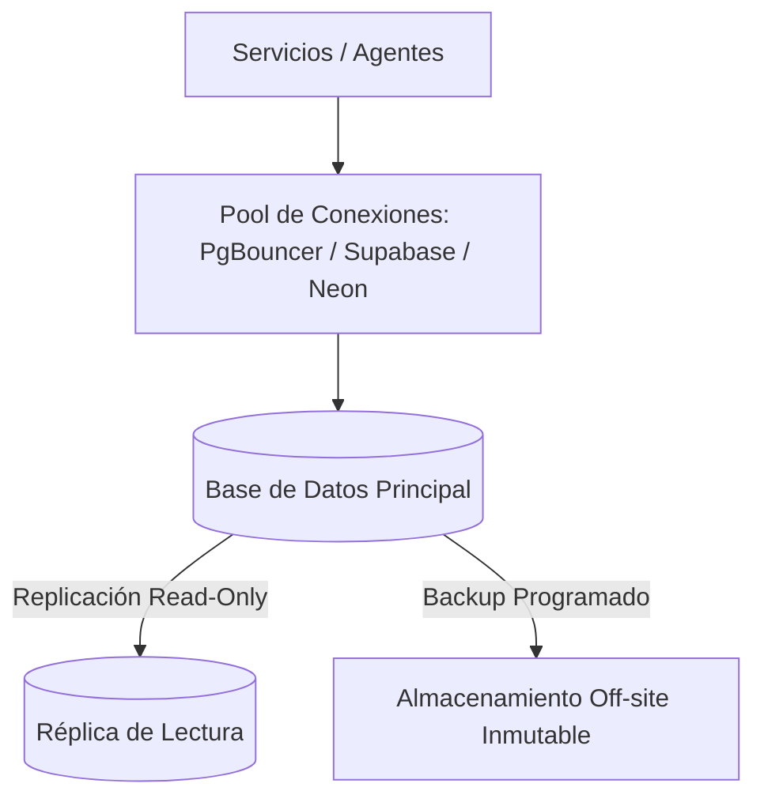

# 🗄️ Skill: Database Resilience & Zero-Downtime Migration Architect

> Esta Skill diseña y audita la arquitectura de bases de datos, garantizando migraciones seguras sin caídas de servicio (*Zero-Downtime Migrations*), resiliencia de datos, pooling eficiente de conexiones y pruebas con seeders automatizados.

---

## 🎯 Arquitectura de Resiliencia de Datos

---

## 🔄 Protocolo de Migración y Resiliencia

### 1. Migraciones Seguras Sin Caídas (Zero-Downtime Migrations)
* **Estrategia Expand-Contract:**
  1. *Expandir:* Añadir nuevas columnas/tablas manteniendo las antiguas compatibles.
  2. *Migrar:* Copiar o transformar datos en segundo plano.
  3. *Contraer:* Eliminar campos obsoletos únicamente tras desplegar y verificar el nuevo código.
* **Prohibido Modificaciones Destructivas Directas:** Nunca ejecutar `DROP COLUMN` o `ALTER TABLE RENAME` en producción sin una migración progresiva.

### 2. Connection Pooling y Rendimiento (PgBouncer / Serverless DB)
* Configurar pooling de conexiones para evitar agotar el límite de sockets de PostgreSQL durante picos de tráfico de bots o webhooks.
* Consultas parametrizadas obligatorias para prevenir SQL Injection e indexación estratégica en claves foráneas y búsquedas frecuentes.

### 3. Seeders Automatizados y Backups
* Generación de *Seeders* parametrizados con datos sintéticos para pruebas de desarrollo aisladas.
* Verificación periódica de restauraciones limpias de backups (*Disaster Recovery Testing*).
