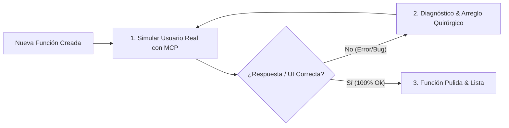

# 🧪 Skill: E2E MCP User Tester (Bucle Autónomo de Prueba de Usuario Real)

> Esta Skill permite probar cada nueva función o módulo recién creado como si el agente fuera un usuario humano real, utilizando herramientas MCP (DevTools, Navegador, APIs), ejecutando un bucle cerrado de verificación y pulido continuo.

---

## 🔄 El Bucle Autónomo de Prueba y Pulido

---

## 🛠️ Herramientas MCP y Estrategia de Prueba

### 1. Interacción Visual y UI (Chrome DevTools / Open Design MCP)
* **Visualización de Componentes:** Renderizado y verificación de layout, botones y modales.
* **Prueba de Clics e Inputs:** Simulación de tipeo de usuario, submit de formularios y navegación entre páginas.
* **Captura de Consola y Red:** Inspección de errores en la consola JavaScript (`console.error`) y estados HTTP de red (4xx, 5xx).

### 2. Validación de APIs y Webhooks (API / Server MCP Tools)
* **Pings y Payloads:** Envío de solicitudes HTTP reales a endpoints recien creados para verificar schemas y respuestas JSON.
* **Verificación de Carga de BD:** Confirmación de que los datos probados se persistan correctamente en la base de datos.

---

## 📋 Pasos del Protocolo E2E

1. **Definición del Escenario de Prueba de Usuario:**
   * Establecer la acción esperada: *"El usuario entra al CRM, hace clic en 'Nuevo Lead', ingresa datos y guarda"*.

2. **Ejecución de la Prueba (Test Run):**
   * Invocar la herramienta MCP correspondiente (ej: `open-design`, `chrome-devtools`, o solicitudes API directas).
   * Monitorear el tiempo de respuesta (<100ms) y estados de UI (Loading, Success, Empty, Error).

3. **Bucle de Pulido (Test-Fix Loop):**
   * Si se detecta un error visual, falla de API o timeout:
     1. Extraer la causa raíz exacta de la consola o log.
     2. Aplicar un **arreglo quirúrgico** (sin alterar código ajeno).
     3. **Re-ejecutar la prueba inmediatamente** mediante MCP.
     4. Repetir hasta obtener 0 errores y confirmación visual/funcional limpia.

4. **Certificación de Entrega:**
   * Confirmar que la función responde correctamente a entradas normales, datos inválidos (edge cases) y carga rápida.
