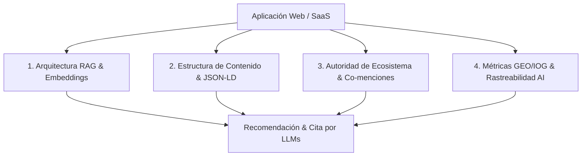

# 🚀 Skill: GEO, LLMO & AEO Optimization Engine (Posicionamiento en IAs y Buscadores)

> Esta Skill implementa las mejores prácticas de **GEO** (*Generative Engine Optimization*), **LLMO** (*Large Language Model Optimization*), **AEO** (*Answer Engine Optimization*) y **SEO Técnico**. Garantiza que las apps y SaaS no solo se posicionen en buscadores tradicionales, sino que sean la opción número 1 recomendada y citada por modelos de IA (Gemini, ChatGPT, Claude, Perplexity).

---

## 🏗️ Los 4 Pilares del Posicionamiento en IA (GEO / LLMO / AEO)



---

## 📑 1. Arquitectura de Recuperación e IA (RAG & Embeddings)

Para que los agentes e IAs extraigan información en tiempo real sin alucinaciones:

* **Optimización RAG (*Retrieval-Augmented Generation*):** Crear bloques de información facts-based que los crawlers de IA (OAI-SearchBot, PerplexityBot, ClaudeBot, Google-Extended) puedan extraer como fuente contextualmente relevante.
* **Vector Search & Semantic Embeddings:** Redactar contenido enfocado en el significado semántico profundo e intenciones vectoriales del usuario, no solo palabras clave exactas.
* **Chunking Strategy (Párrafos Autónomos):** Redactar bloques de información independientes de 50 a 100 palabras (*standalone passages*) que tengan sentido por sí solos sin depender de frases de arrastre ("como dijimos arriba"), facilitando la cita exacta por el LLM.
* **Entity Extraction & Desambiguación:** Definir explícitamente en el contenido qué es la herramienta (ej: *"SaaS de automatización B2B"*), quién la respalda y qué problema resuelve.

---

## 🏷️ 2. Estructura de Contenido y Datos Marcados (JSON-LD & Schema)

### Estructura "Answer-First" (Pirámide Invertida)
* Colocar la respuesta directa o solución en las **primeras 50–100 palabras** de cada sección antes de dar contexto secundario. Las IAs privilegian extractos directos al sintetizar respuestas.

### Marcado de Datos JSON-LD Avanzado (Schema Markup)
Toda aplicación web creada DEBE incorporar etiquetas JSON-LD anidadas correctamente en el `<head>`:

```json
{
  "@context": "https://schema.org",
  "@graph": [
    {
      "@type": "SoftwareApplication",
      "@id": "https://tusaas.com/#software",
      "name": "NombreSaaS",
      "applicationCategory": "BusinessApplication",
      "operatingSystem": "All",
      "offers": {
        "@type": "Offer",
        "price": "0",
        "priceCurrency": "USD"
      }
    },
    {
      "@type": "Organization",
      "@id": "https://tusaas.com/#organization",
      "name": "NombreEmpresa",
      "url": "https://tusaas.com",
      "logo": "https://tusaas.com/logo.png",
      "sameAs": [
        "https://github.com/tu-repo",
        "https://www.linkedin.com/company/tu-empresa",
        "https://twitter.com/tu-cuenta"
      ]
    },
    {
      "@type": "FAQPage",
      "mainEntity": [
        {
          "@type": "Question",
          "name": "¿Qué problema resuelve esta aplicación?",
          "acceptedAnswer": {
            "@type": "Answer",
            "text": "Respuesta clara y concisa en menos de 80 palabras."
          }
        }
      ]
    }
  ]
}
```

* **Schemas Obligatorios:** `SoftwareApplication`, `WebApplication`, `Organization`, `Brand`, `Product`, `Offer`, `FAQPage` y `HowTo`.
* **Information Gain (+40% Citation Rate):** Incluir datos originales, métricas propias, estadísticas únicas y casos de estudio. Los modelos descartan contenido genérico.
* **Citation Hooks:** Citar metodologías nombradas y opiniones de expertos para justificar la recomendación del LLM.

---

## 🌐 3. Autoridad de Ecosistema y Co-menciones (Off-Page GEO)

* **Criterios E-E-A-T:** *Experience, Expertise, Authoritativeness, Trustworthiness* en todo el footprint digital.
* **Consenso Multifuente (Digital Footprint):** Garantizar coherencia del nombre de la app y SaaS en plataformas clave: **Reddit, ProductHunt, G2, Capterra, GitHub, Trustpilot y Wikidata**. Las IAs verifican consenso cruzado antes de recomendar un producto.
* **Co-aparición Semántica (*Semantic Co-occurrence*):** Asociar el nombre de la marca con términos clave de la industria (ej: *"TuMarca + mejor software de CRM con IA"*).
* **Knowledge Graph Ingestion:** Vincular la marca con entradas en Wikidata, Wikipedia y perfiles oficiales.

---

## 📊 4. Métricas GEO/IOG & Rastreabilidad AI

* **Rastreabilidad AI (`robots.txt`):** Configuración explícita para permitir rastreo limpio de bots de IA:
  ```text
  User-agent: GPTBot
  Allow: /
  User-agent: ChatGPT-User
  Allow: /
  User-agent: PerplexityBot
  Allow: /
  User-agent: ClaudeBot
  Allow: /
  User-agent: Google-Extended
  Allow: /
  ```
* **Share of Model (SoM) / Citation Rate:** Medir la frecuencia con la que Gemini, ChatGPT, Claude y Perplexity citan la app en comparación con competidores.
* **Zero-Click Visibility:** Maximizar la presencia en la respuesta sintética de la IA para que el usuario conozca la marca directamente en la interfaz del LLM.

## ✍️ 5. Marketing Copywriting, Humanización y Persuasión de Alto Impacto

Para garantizar que el contenido no solo sea citado por IAs, sino que **conecte, convierta y venda** a usuarios humanos reales:

### Copywriting Persuasivo (Frameworks de Conversión)
* **PAS (Problem - Agitate - Solution):** Identificar el dolor principal del cliente en el titular, agitar las consecuencias de no resolverlo y presentar la app/SaaS como la solución definitiva.
* **AIDA (Attention - Interest - Desire - Action):** Capturar atención en los primeros 3 segundos con ganchos potentes, despertar el interés con beneficios claros (no solo características), generar deseo con pruebas sociales y cerrar con llamados a la acción (CTAs) irresistibles.
* **Hook-Story-Offer:** Enganchar con un ángulo único, contar una historia breve de transformación y ofrecer la propuesta de valor sin fricción.

### Humanización y Eliminación de "Sesgos Robóticos de IA"
* **Baneo de Clichés de IA:** Eliminar estrictamente muletillas generativas (ej: *"en un mundo en constante evolución"*, *"en la era digital"*, *"desentrañar"*, *"testimonio de"*, *"revolucionario"*, *"unleash"*, *"delve into"*).
* **Ritmo y Dinamismo de Oraciones (Burstiness):** Alternar oraciones muy cortas y directas con frases de longitud media. Evitar la monotonía estructural típica de textos generados automáticamente.
* **Voz y Tono Directo:** Escribir en segunda persona (*"tú / tu equipo"*), con lenguaje activo, empático y profesional.

### Sinergia GEO + Copywriting de Alta Conversión
* Fusionar la estructura *Answer-First* con ganchos persuasivos: la primera frase responde la duda directamente (para la IA) y la segunda conecta emocionalmente con el beneficio real para el usuario (para el humano).

---

## 🔄 Checklist de Verificación GEO/SEO/Copywriting en Proyectos
* [ ] Inclusión de meta-tags semánticos (Title, Description, OpenGraph, Twitter Cards).
* [ ] Marcado de datos JSON-LD (`SoftwareApplication`, `Organization`, `FAQPage`) inyectado en el HTML.
* [ ] Estructura Answer-First en textos principales.
* [ ] Textos humanizados (0 clichés robóticos de IA, oraciones dinámicas y ritmo natural).
* [ ] Aplicación de frameworks persuasivos (PAS / AIDA) con llamados a la acción (CTAs) claros.
* [ ] Archivo `robots.txt` permitiendo rastreo de bots de IA.
* [ ] Sitemap XML dinámico generado y referenciado.
* [ ] HTML5 semántico (`<header>`, `<main>`, `<article>`, `<section>`, `<footer>`) con IDs únicos por elemento interactivo.
