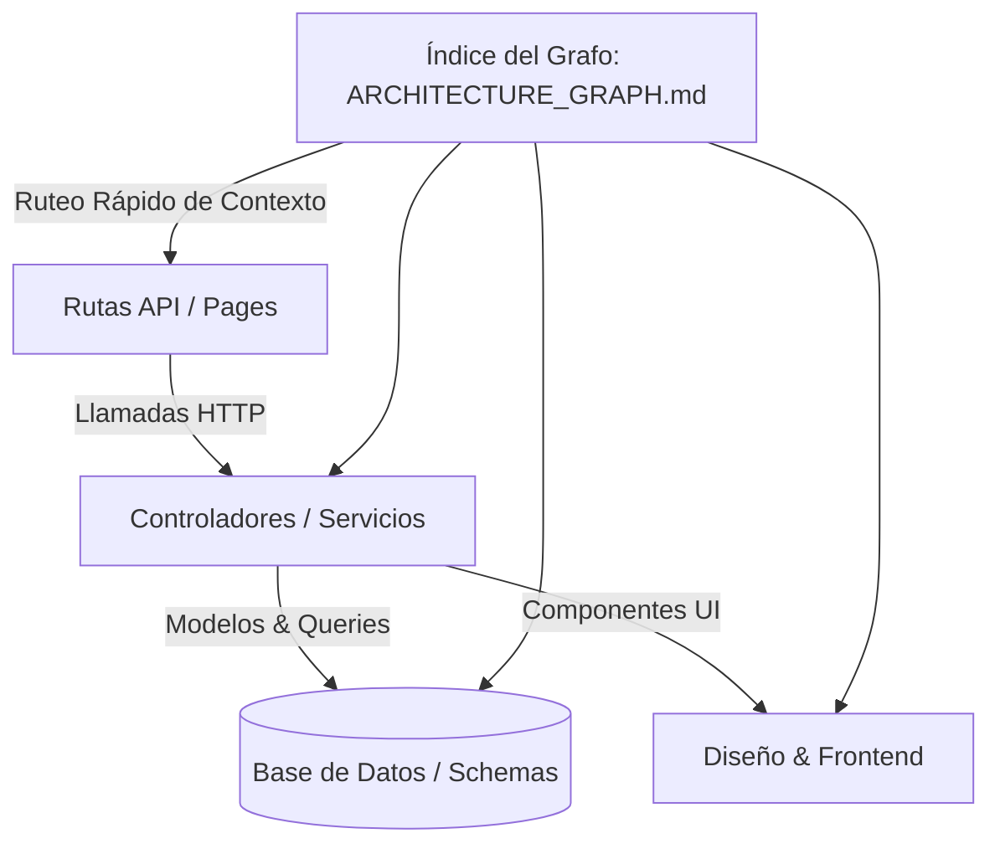

# 🧠 Skill: Graph Codebase Memory & Indexer (Memoria en Grafo y Ruteo Inteligente)

> Esta Skill construye y mantiene un **Grafo de Conocimiento del Codebase**. Mapea módulos, rutas de API, esquemas de BD y relaciones de archivos en un índice estructurado. Permite al agente navegar directamente al punto exacto del código, reduciendo el consumo de tokens y acumulando inteligencia acumulativa entre sesiones.

---

## 🎯 Arquitectura de la Memoria en Grafo

---

## 🔄 Protocolo de Funcionamiento

### Paso 1: Mapeo Inicial e Indexación del Proyecto
1. Inspeccionar la estructura de carpetas, configuraciones (`package.json`, `tsconfig.json`, `schema.prisma`, etc.) y puntos de entrada.
2. Generar el mapa del proyecto en `.agent/memory/ARCHITECTURE_GRAPH.md` documentando:
   * **Nodos Principales:** Monorepos (`apps/`, `packages/`), módulos y componentes clave.
   * **Rutas & Endpoints:** Mapeo de llamadas API con sus controladores y tablas correspondientes.
   * **Esquemas de Datos:** Modelos de BD, interfaces de datos principales y DTOs.

### Paso 2: Ruteo Inteligente y Ahorro Extremo de Tokens
1. **Consulta Previa al Grafo:** Antes de buscar archivos a ciegas, el agente consulta `ARCHITECTURE_GRAPH.md` para identificar los archivos y rangos de líneas exactos a inspeccionar.
2. **Evitar Lecturas Redundantes:** Al conocer la topología completa del sistema, se evita leer archivos no relacionados, optimizando el uso de la ventana de contexto y reduciendo el consumo de tokens hasta en un 80%.

### Paso 3: Actualización Incremental y Aprendizaje Evolutivo
1. Cada vez que se crea, modifica o elimina un archivo:
   * Se actualiza únicamente el nodo afectado y sus dependencias directas dentro del Grafo de Conocimiento.
   * Se registran las decisiones de arquitectura aprendidas en `MEMORY.md`.
2. Con cada sesión, el proyecto acumula contexto estructurado, haciendo al agente cada día más veloz e inteligente sobre la plataforma.

### Paso 4: Security Gate para Herramientas de Indexación Externa
1. Si se utilizan plugins o librerías de indexación externa (ej: herramientas AST, analizadores estáticos), deben ser auditadas previamente mediante `security-audit-sentinel` para certificar que operen 100% de forma local y segura.
