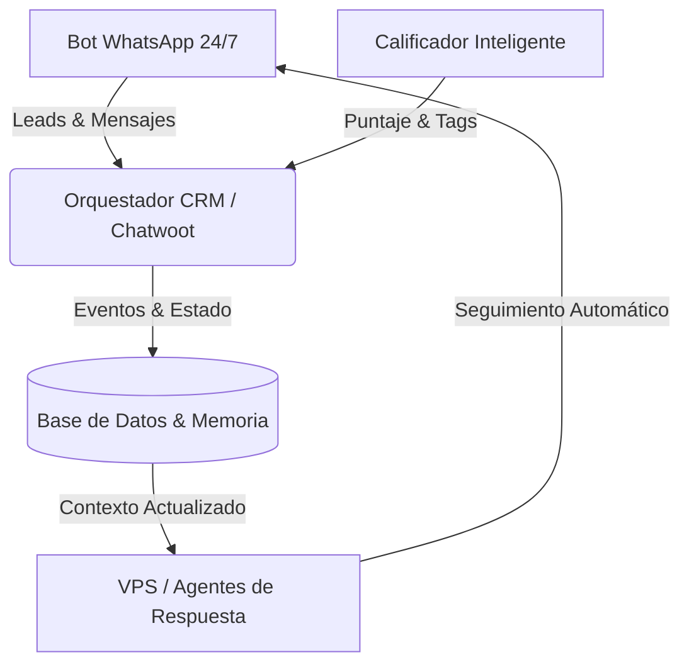

# 🧬 Skill: Live System Interconnection (Auditoría de Sistema Vivo)

> Esta Skill audita la interconexión holística de la plataforma para asegurar que no existan funciones ni módulos aislados, sino un organismo vivo donde todos los componentes alimentan la infraestructura central de negocio.

---

## 🎯 Principio Fundamental
Un sistema inteligente no es una colección de scripts desconectados. Es un **organismo vivo** donde cada nuevo bot, calificador o webhook actualiza en tiempo real el contexto del CRM, la base de datos y la analítica de ventas.

---

## 📋 Checklist de Interconexión del Sistema

### 1. Auditoría de Flujo de Datos (End-to-End Data Pipeline)
* [ ] ¿El bot de comunicación (WhatsApp/Telegram) sincroniza cada nuevo mensaje o estado directamente con el CRM?
* [ ] ¿El calificador de leads escribe sus resultados de scoring en el perfil del cliente dentro de la base de datos o CRM?
* [ ] ¿Las citas agendadas actualizan automáticamente el estado del Lead en el CRM/Kanban?

### 2. Eliminación de Islas Tecnológicas
* [ ] Garantizar que **ningún módulo operante** guarde datos en memoria volátil sin persistirlos en el almacenamiento central.
* [ ] Comprobar que los webhooks recibidos manejen fallas de red con reintentos y logs estructurados.

### 3. Matriz de Cohesión Operativa
* **Entrada:** Interacción del cliente.
* **Procesamiento:** Clasificación por IA + Reglas de Negocio.
* **Persistencia:** Almacenamiento parametrizado en DB / JSON.
* **Salida:** Notificación en CRM + Respuesta automatizada + Métrica de conversión.

---

## 🔄 Protocolo de Verificación
1. **Tracing de Eventos:** Rastrea un mensaje desde la entrada en el bot hasta su reflejo final en el CRM.
2. **Sanidad de API Contracts:** Verifica que los payloads JSON entre servicios respeten los schemas tipados.
3. **Cierre del Bucle de Datos:** Asegura que cualquier acción del usuario o del agente alimente el contexto futuro del sistema.
