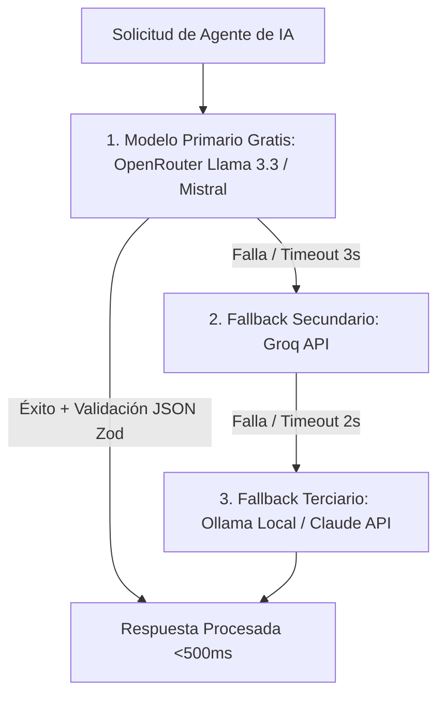

# 🤖 Skill: LLM Prompt Engineering, Cost & Latency Optimizer

> Esta Skill diseña, audita y optimiza las llamadas a Modelos de Lenguaje (LLMs). Garantiza respuestas ultrarrápidas, costos mínimos ($0 o casi $0 mediante fallback de modelos gratuitos en OpenRouter), cero alucinaciones de formato y validación estricta de esquemas JSON.

---

## 🎯 Arquitectura de Conmutación y Resiliencia de LLMs



---

## 🔄 Protocolo de Ingeniería de Prompts

### 1. Validación Estricta de Salida (Zero-Hallucination JSON)
* **Validación con Schemas (Zod / Pydantic):** Parsear cada respuesta del LLM contra un esquema tipado estricto antes de consumirla en el código.
* **Instrucciones de Delimitadores:** Forzar el formato mediante bloques limpios de JSON (````json ... ````) prohibiendo texto conversacional introductorio.

### 2. Cadenas de Fallback de Modelos ($0 Default Cost)
* Configurar prioridad predeterminada en modelos gratuitos (`openrouter/free` -> Groq Free Tier -> Llama 3.3 70B).
* Implementar reintentos con retrasos incrementales (3s ➔ 2s) ante fallas de red con la API del LLM.

### 3. Compresión de Prompts y Gestión de Contexto
* **Token Trimming:** Filtrar historial innecesario del chat enviando únicamente los últimos N mensajes relevantes.
* **System Prompts Claros y Concisos:** Instrucciones de rol en segunda persona directas y sin redundancias.
