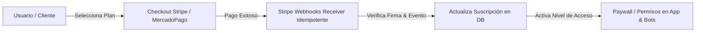

# 💳 Skill: Monetization & Stripe Billing Engine (Monetización y Pagos)

> Esta Skill implementa la infraestructura de monetización y facturación para transformar aplicaciones y Sistemas Inteligentes en productos comerciales rentables, integrando Stripe, suscripciones, paywalls y webhooks de pago seguros.

---

## 🎯 Arquitectura de Monetización y Cobros

---

## 🔄 Protocolo de Implementación de Monetización

### 1. Modelos de Cobro y Suscripciones (Stripe Billing)
* **Suscripciones Recurrentes:** Configuración de planes (Free Tier, Pro, Enterprise) con períodos de prueba (*Free Trials*) y ciclos de facturación mensual/anual.
* **Cobro por Uso (Metered Billing):** Medición de créditos consumidos por ejecuciones de agentes IA, mensajes de WhatsApp o llamadas a la API.

### 2. Manejo Seguro de Webhooks de Pago
* **Verificación de Firma:** Validar la firma criptográfica (`Stripe-Signature`) de cada webhook entrante para prevenir suplantaciones de pago.
* **Idempotencia de Eventos (`evt_id`):** Procesar cada evento de pago (`checkout.session.completed`, `customer.subscription.deleted`) una sola vez.

### 3. Paywall y Control de Accesos (Tier Permission Control)
* **Middleware de Autorización:** Bloquear funcionalidades avanzadas si la suscripción del cliente está inactiva o cancelada.
* **Portal del Cliente:** Proporcionar interfaz para que el usuario gestione sus métodos de pago, descargue facturas y cambie de plan de forma autónoma.
