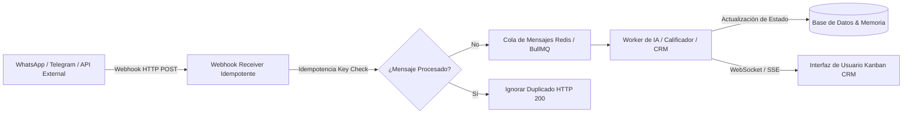

# ⚡ Skill: Realtime WebSocket & Webhook Engine

> Esta Skill diseña y audita la arquitectura de procesamiento de eventos en tiempo real, recepción idempotente de Webhooks y comunicación vía WebSockets o Server-Sent Events (SSE) para CRMs e infraestructuras con IA 24/7.

---

## 🎯 Arquitectura de Procesamiento Real-Time

---

## 🔄 Protocolo de Implementación

### 1. Receptores de Webhooks Idempotentes
* **Clave de Idempotencia (`Idempotency-Key` / `message_id`):** Registrar el ID único del evento en Redis/DB con TTL antes de procesarlo para ignorar reintentos duplicados del proveedor.
* **Respuesta Inmediata <200ms:** Responder HTTP 200 OK inmediatamente al proveedor y enviar el trabajo pesado a una cola asíncrona.

### 2. Gestión de Colas y Resiliencia (BullMQ / Redis)
* **Reintentos con Backoff Exponencial:** Configurar hasta 5 reintentos con retrasos incrementales (1s, 5s, 15s, 60s) ante fallas de red o errores de API externas.
* **Dead Letter Queue (DLQ):** Aislar eventos permanentemente fallidos para inspección manual sin bloquear la cola principal.

### 3. Pipeline de WebSockets / SSE (Server-Sent Events)
* **Actualizaciones Instantáneas en UI:** Transmitir eventos de entrada de leads, mensajes de chat y calificaciones de IA a la interfaz web en tiempo real sin polling.
* **Reconexión Automática:** Implementar cliente de WebSockets con reconexión activa y sincronización de estado tras reconectar.
