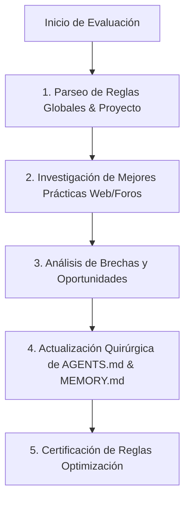

# 🛡️ Skill: Rules Optimizer & Evaluator (Optimizador de Reglas)

> Esta Skill inspecciona, investiga y perfecciona continuamente las **Reglas Maestras y del Proyecto**, investigando mejores prácticas actualizadas de la industria (foros, repositorios, comunidades de desarrollo con IA) y aplicando mejoras quirúrgicas a la doctrina del agente.

---

## 🎯 Principio Fundamental
Las reglas del agente no son estáticas; son un **sistema vivo en constante evolución**. Esta Skill garantiza que el sistema adopte nuevas salvaguardas de seguridad, patrones de código de vanguardia y disciplinas de ingeniería sin romper la base maestra (`user_global`).

---

## 🔄 Protocolo de Ejecución de la Skill

### Paso 1: Parseo de Reglas Existentes
1. Leer los archivos de reglas globales:
   * [`C:\Users\Erick Diaz\.gemini\config\AGENTS.md`](file:///C:/Users/Erick%20Diaz/.gemini/config/AGENTS.md) (Reglas Maestras Globales)
   * [`C:\Users\Erick Diaz\.gemini\config\MEMORY.md`](file:///C:/Users/Erick%20Diaz/.gemini/config/MEMORY.md) (Memoria de Mejoras y Preferencias)
   * [`C:\Users\Erick Diaz\.gemini\config\BUG_HISTORY.md`](file:///C:/Users/Erick%20Diaz/.gemini/config/BUG_HISTORY.md) (Historial de Bugs y Soluciones)
2. Leer las reglas locales del proyecto:
   * `AGENTS.md` (Cerebro del repositorio activo)
   * Archivos dentro de `.agent/rules/` o `PLAN.md`

### Paso 2: Investigación Activa de Mejores Prácticas en la Web
1. Ejecutar búsquedas en foros de desarrolladores, GitHub, Reddit, X (Twitter) y comunidades de IA sobre:
   * Novedades en Agentic Coding & Claude Code / Antigravity OS / OpenAI Agents.
   * Nuevos patrones de seguridad en consola y prevención de loops de IA.
   * Estándares actualizados de desarrollo TDD, Next.js, TypeScript y arquitecturas de CRM con IA.
2. Extraer lecciones aprendidas, nuevos corta-fuegos y patrones de diseño verificados.

### Paso 3: Análisis de Brechas (Gap Analysis)
1. Comparar la base de reglas actual contra las tendencias descubiertas.
2. Identificar:
   * **Reglas Faltantes:** Nuevos corta-fuegos, métricas o técnicas de verificación.
   * **Reglas a Mejorar:** Puntos que requieran mayor claridad o precisión operacional.
   * **Puntos Inmutables:** Mantener intactas las bases fundamentales (Comunicación en Español, Código en Inglés, Modificaciones Quirúrgicas, 5 Leyes de Sistemas Vivos, Terminal Safety y TDD).

### Paso 4: Actualización Quirúrgica de Archivos de Reglas
1. Aplicar los cambios mediante ediciones quirúrgicas en `AGENTS.md` y `MEMORY.md`.
2. Documentar la fecha, origen de la mejora y el impacto de la nueva regla en `MEMORY.md`.
3. Actualizar el `AGENTS.md` local del repositorio para incluir las optimizaciones específicas del proyecto.

### Paso 5: Certificación y Verificación
1. Validar que la sintaxis de los archivos de reglas esté en Markdown estricto de GitHub.
2. Confirmar que no existan reglas contradictorias o redundantes.
