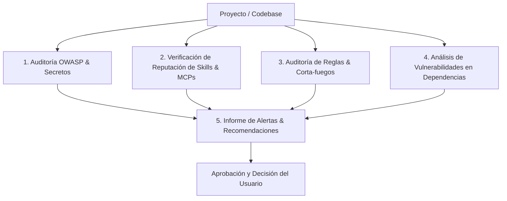

# 🛡️ Skill: Security Audit Sentinel (Capa de Seguridad y Blindaje)

> Esta Skill inspecciona la seguridad del código, evalúa la reputación e inocuidad de las skills y plugins instalados, audita las reglas globales/locales en busca de riesgos operativos y genera informes de recomendaciones para aprobación del usuario.

---

## 🎯 Pilares del Blindaje de Seguridad



---

## 🔄 Protocolo de Ejecución de la Skill

### Paso 1: Escaneo de Código y Secretos (OWASP Top 10)
1. **Escaneo de Secretos Expuestos:**
   * Buscar en todo el código keys de APIs, tokens JWT, contraseñas quemadas (*hardcoded*) o credenciales en archivos sin `.env`.
2. **Prevención de Inyecciones:**
   * Auditar consultas a bases de datos (verificar parametrización contra SQL Injection).
   * Inspeccionar la desinfección de entradas de usuario en APIs, webhooks e interfaces (XSS, Command Injection, uso de `eval()` o comandos shell no validados).
3. **Seguridad en Autenticación y CORS:**
   * Validar manejo seguro de cookies, políticas de CORS y rutas protegidas.

### Paso 2: Análisis de Reputación e Inocuidad de Skills, Plugins y MCPs
1. Inspeccionar todas las skills instaladas en `C:\Users\Erick Diaz\.gemini\config\skills` y `.agents/skills/`.
2. Inspeccionar plugins y servidores MCP (`mcp_config.json`).
3. **Verificación de Seguridad en Skills/Plugins:**
   * Comprobar que no contengan scripts maliciosos, llamadas de red no verificadas a servidores desconocidos o comandos destructivos.
   * Verificar en la web/comunidades la reputación y origen de las habilidades o librerías de terceros.
4. **Alertas de Procesos Peligrosos:**
   * Si una skill/MCP requiere permisos de comodín (`*`), ejecución arbitraria de código o borrado de archivos fuera de sandbox, emitir **Alerta de Seguridad** inmediata al usuario.

### Paso 3: Auditoría y Fortalecimiento de Reglas (Rules Hardening)
1. Inspeccionar `AGENTS.md` (global y local) y `MEMORY.md`.
2. Evaluar si existen reglas ambiguas o peligrosas (ej: ejecución de comandos destructivos sin confirmación, instalación de paquetes no verificados).
3. Formular recomendaciones para endurecer las reglas (ej: obligatoriedad de flags no interactivas seguras, sanitización previa de entradas, restrictivos de `.env`).

### Paso 4: Búsqueda Web de Vulnerabilidades (CVE & Advisory DBs)
1. Analizar dependencias en `package.json`, `requirements.txt` o `Cargo.toml`.
2. Buscar en bases de datos de vulnerabilidades (NVD, CVE, Snyk, GitHub Advisory) fallos conocidos en las versiones de librerías utilizadas.

### Paso 5: Generación del Informe de Alertas y Decisiones del Usuario
Presentar al usuario un informe claro categorizado por nivel de severidad:

```markdown
# 🚨 Informe de Auditoría de Seguridad

## 🔴 Alertas Críticas (Acción Inmediata)
- [Detalle de vulnerabilidad o secreto expuesto] -> Recomendación de solución.

## 🟡 Alertas de Riesgo Medio (Skills / Reglas a Mejorar)
- [Skill o Regla evaluada] -> Riesgo detectado -> Sugerencia de ajuste seguro.

## 🟢 Verificaciones Aprobadas
- [Puntos de seguridad validados con 0 riesgos].

### ⚖️ Decisión Requerida:
Indique si aprueba la aplicación de los parches y mejoras de seguridad recomendados.
```
