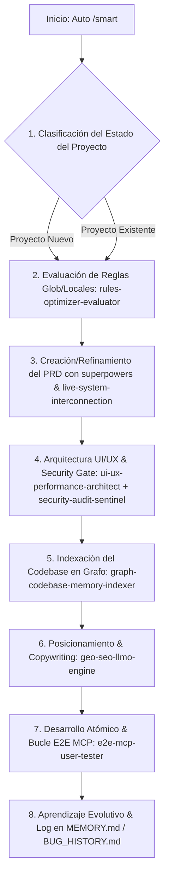

# 🤖 Master Skill: Smart Systems Builder (Orquestador Autónomo)

> Esta Skill actúa como el **Cerebro Orquestador Autónomo** del sistema. Se inicia automáticamente al instalarse en un proyecto o ejecutando la instrucción `/smart`. Clasifica el estado del proyecto (Nuevo o Existente), audita las reglas globales, construye o refina el PRD, indexa el codebase en grafos y ejecuta un desarrollo guiado por la Doctrina del Sistema Vivo.

---

## ⚡ Activación e Instrucción `/smart`

* **Gatillo Automático:** Se ejecuta al iniciar una sesión de desarrollo o al instalar la skill en el repositorio.
* **Comando Slash:** Se puede invocar explícitamente en el chat enviando `/smart` o solicitando construir/mejorar un sistema inteligente.

---

## 🔄 Flujo Lógico de Ejecución Automática

---

## 📋 Desglose Detallado del Flujo Operativo

### 🔍 Fase 1: Identificación Inteligente del Estado del Proyecto
El agente inspecciona el workspace activo para clasificar el estado:
* **Escenario A: Proyecto Nuevo (Empty / Scaffold):**
  * Directorio vacío o solo con archivos de configuración inicial (`package.json`, `.gitignore`).
  * *Acción:* Iniciar flujo desde cero con creación de arquitectura y PRD desde el origen.
* **Escenario B: Proyecto Existente (Refactor / Feature / Mejora):**
  * Código base existente, rutas API, componentes o base de datos en operación.
  * *Acción:* Analizar la arquitectura actual, consultar el Grafo de Conocimiento y refinar el PRD existente sin romper código funcional.

---

### 🛡️ Fase 2: Inspección y Optimización de Reglas (`rules-optimizer-evaluator`)
1. Leer las Reglas Maestras Globales ([`AGENTS.md`](file:///C:/Users/Erick%20Diaz/.gemini/config/AGENTS.md)) y locales del proyecto.
2. Invocar la skill **`rules-optimizer-evaluator`**:
   * Buscar en la web/foros las mejores prácticas vigentes de ingeniería con IA.
   * Optimizar, pulir e incorporar reglas faltantes (seguridad en terminal, TDD, Basecamp/Stripe/Apple UI).
   * Validar el cumplimiento inmutable del idioma (Español en chat, Inglés en código).

---

### 📜 Fase 3: Generación o Refinamiento del PRD (`superpowers` & `live-system-interconnection`)
1. Invocar la skill **`superpowers`** (Metodología de 7 fases y TDD).
2. **Si es Proyecto Nuevo:** Redactar un `PRD.md` exhaustivo guiado por la **Doctrina del Sistema Vivo**:
   * *Sección 1:* Visión comercial e Infraestructura (CRM Chatwoot/Deskcomm, Agentes WhatsApp 24/7, Memoria, Métricas).
   * *Sección 2:* Doctrina del Sistema y Reglas del Dominio.
   * *Sección 3:* Criterios de Aceptación por Módulo.
   * *Sección 4:* Stack Tecnológico (VPS, Next.js App Router, TypeScript, PostgreSQL/JSON).
   * *Sección 5:* Desglose Atómico de Fases ("Una sola cosa a la vez").
3. **Si es Proyecto Existente:** Invocar **`live-system-interconnection`** para auditar que los nuevos módulos no queden como islas aisladas y se integren con la base de datos y CRM actual.
4. Invocar **`customer-agent-protocol-onboarding`**:
   * Ejecutar la matriz de entrevista de onboarding (4 preguntas: tono/estilo, objetivo a resolver, público objetivo y detalles del proyecto).
   * Configurar el System Prompt base, base de conocimiento RAG (vector DB), guardrails anti-alucinaciones y el protocolo de escalado a operador humano (Human Handoff en Chatwoot).

---

### 🎨 🛡️ Fase 4: Arquitectura UI/UX, Rapidez, VPS y Security Gate
1. Invocar **`ui-ux-performance-architect`**:
   * Diseñar tokens de UI (Bento Grid, Glassmorphism, respuesta <100ms, accesibilidad A11y, estados Loading/Empty/Error/Success).
2. Invocar **`vps-docker-autodeployer`**:
   * Configurar contenedorización Docker, proxy inverso (Caddy/Nginx), SSL y despliegue de herramientas CRM (Chatwoot, Evolution API, N8N) en VPS propias.
3. Invocar **`database-resilience-migration-architect`**:
   * Garantizar migraciones zero-downtime, connection pooling (PgBouncer) y resiliencia de datos.
4. Invocar **`security-audit-sentinel`** (Security Gate Obligatorio):
   * Escanear secretos expuestos, vulnerabilidades OWASP y dependencias.
   * Auditar e investigar la reputación de cualquier skill externa necesaria antes de ser instalada.

---

### 🗺️ Fase 5: Indexación del Codebase en Grafo (`graph-codebase-memory-indexer`)
1. Invocar **`graph-codebase-memory-indexer`**:
   * Generar o actualizar `.agent/memory/ARCHITECTURE_GRAPH.md` mapeando componentes, endpoints API y esquemas de BD.
   * Garantizar ruteo directo de contexto para ahorrar hasta un 80% de tokens por sesión.

---

### 🚀 ✍️ 💳 Fase 6: Posicionamiento GEO/LLMO, Monetización & Prompts (`geo-seo-llmo-engine`, `monetization-stripe-billing-engine`, `llm-prompt-cost-optimizer`)
1. Invocar **`geo-seo-llmo-engine`**:
   * Inyectar esquema JSON-LD (`SoftwareApplication`, `Organization`, `FAQPage`).
   * Aplicar redacción *Answer-First* y párrafos autónomos de 50-100 palabras.
   * Redactar copys persuasivos (PAS / AIDA) humanizados y libres de clichés robóticos de IA.
2. Invocar **`monetization-stripe-billing-engine`**:
   * Configurar infraestructura de pagos, suscripciones (Stripe / MercadoPago), paywalls y cobros por uso.
3. Invocar **`llm-prompt-cost-optimizer`**:
   * Configurar cadenas de fallback gratis (OpenRouter -> Groq -> Ollama), validación de JSON estricto Zod y costo/latencia optimizados.

---

### 🔬 ⚡ Fase 7: Desarrollo Atómico, Eventos Real-Time y Bucle E2E MCP (`e2e-mcp-user-tester`, `realtime-websocket-webhook-engine`)
1. Invocar **`realtime-websocket-webhook-engine`**:
   * Configurar recepción idempotente de webhooks, colas Redis/BullMQ y eventos WebSockets/SSE en tiempo real.
2. Tomar una sola tarea a la vez del `PRD.md`.
3. Implementar cambios quirúrgicos con pruebas TDD.
4. Invocar **`e2e-mcp-user-tester`**:
   * Ejecutar la prueba de usuario real usando MCP (DevTools / Navegador / API pings).
   * Si detecta fallas, aplicar arreglo quirúrgico y re-probar inmediatamente en bucle cerrado hasta pulir al 100%.

---

### 🧠 Fase 8: Aprendizaje Evolutivo y Log en Memoria Global
1. Registrar bugs complejos resueltos en `BUG_HISTORY.md`.
2. Registrar aprendizajes arquitectónicos en `MEMORY.md`.
3. Actualizar el `AGENTS.md` local del repositorio para garantizar continuidad perfecta entre sesiones.
