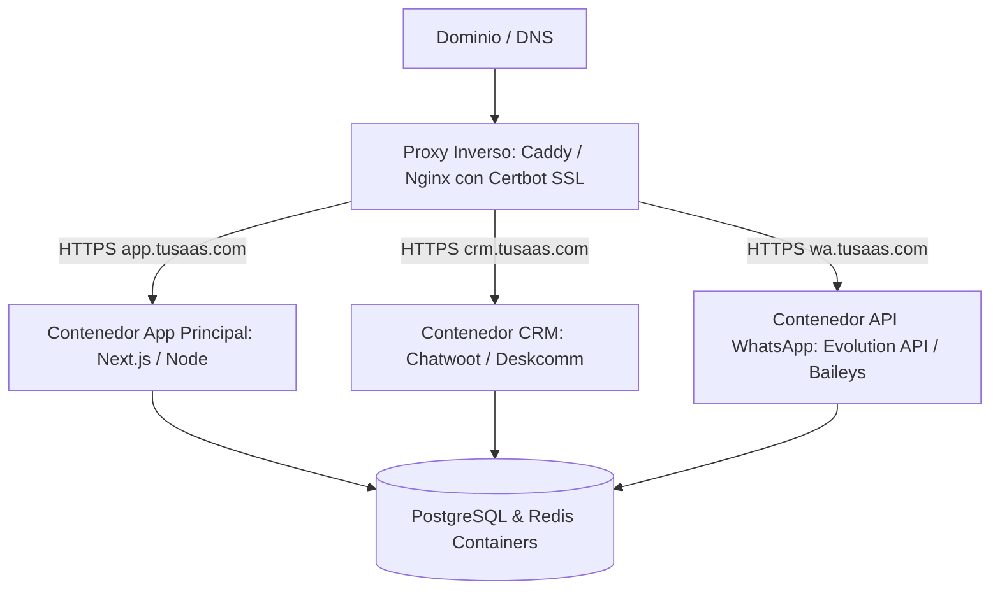

# 🐳 Skill: VPS & Docker Auto-Deployer (Despliegue e Infraestructura Propia)

> Esta Skill automatiza la contenedorización y despliegue de aplicaciones full-stack y herramientas CRM open-source en servidores VPS (Contabo, Hetzner, DigitalOcean) utilizando Docker, Caddy/Nginx y SSL automático, maximizando el margen comercial al reducir costos de licencias de terceros.

---

## 🎯 Arquitectura de Auto-hosting en VPS

---

## 🔄 Protocolo de Despliegue Autónomo

### 1. Generación de Dockerfile y Docker Compose
* **Multi-stage Builds:** Dockerfiles optimizados para entornos de producción en Next.js / Node / Python con imágenes ligeras (`alpine` / `slim`).
* **Docker Compose Modular:** Configuración de servicios aislados con redes internas seguras (`networks`), volúmenes persistentes (`volumes`) y variables de entorno vía `.env`.

### 2. Configuración de Proxy Inverso & SSL
* **Caddy / Nginx:** Proxy inverso automatizado con renovación automática de SSL mediante Let's Encrypt / Certbot.
* **Cabeceras de Seguridad:** Configuración de `HSTS`, `X-Frame-Options`, `X-Content-Type-Options` y compresión `Gzip/Brotli`.

### 3. Instalación de Herramientas Open-Source
* **Chatwoot / Deskcomm CRM:** Despliegue de la suite de atención omnicanal.
* **Evolution API / Baileys:** Instancia autónoma para conexión directa con WhatsApp Web semioficial sin depender de APIs costosas.
* **Politicas de Auto-restart:** Configurar `restart: unless-stopped` y *healthchecks* en todos los contenedores.
