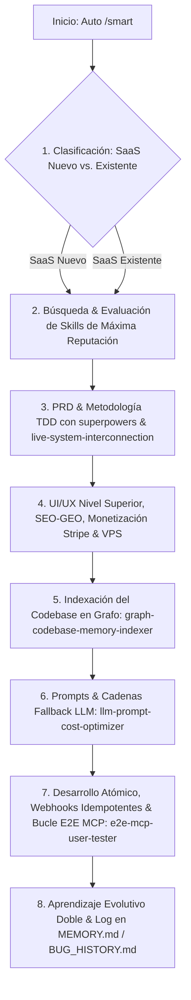

# 🚀 saas-smart-engine

> **Motor Inteligente de Agentes para Construir tu Plataforma SaaS sin fallos, de forma inteligente y con barandas de seguridad.**  
> Obtén resultados de nivel profesional en diseño UI/UX (Bento Grid, Glassmorphism), SEO-GEO, seguridad, rapidez, monetización con Stripe e indexación del proyecto con ahorro de tokens hasta 20x.

[](https://opensource.org/licenses/MIT)
[](https://nodejs.org/)
[](https://www.npmjs.com/)
[](https://github.com/growthack7/saas-smart-engine)

---

## 🎯 ¿Qué es saas-smart-engine y qué logras con él?

**`saas-smart-engine`** es la suite definitiva de habilidades y reglas maestras para crear o transformar cualquier aplicación en una **Plataforma SaaS de Alta Producción** sin depender de conocimientos avanzados de programación.

El motor analiza tu proyecto o PRD, busca e instala automáticamente las **habilidades (skills) más votadas y mejor calificadas de la comunidad**, aplica la **Doctrina del Método Stanford** y guía a tus agentes de IA para entregar software pulido al 100%.

---

## 🔄 Flujo Lógico Automático del Sistema (`/smart`)

El sistema funciona de forma **autónoma al instalarse o mediante el comando `/smart`**:



### 🔍 1. SaaS Nuevo vs. SaaS Existente:
* **SaaS Nuevo:** Diseña la arquitectura desde cero, crea el modelo de suscripciones, esquemas de BD y PRD con *Superpowers*.
* **SaaS Existente:** Audita el código activo, busca e integra las mejores skills del mercado y optimiza el rendimiento sin romper funcionalidades existentes.

---

## 🚀 Beneficios Principales & Propuesta de Valor

* ⭐ **Búsqueda e Instalación de Skills de Alta Reputación:** El sistema evalúa el proyecto, busca en la comunidad las habilidades mejor calificadas, audita su seguridad vía *Security Gate* e instala lo necesario automáticamente.
* 🧠 **Indexación del Proyecto en Grafo (Ahorro 20x Tokens):** Navegación semántica directa en mapas del codebase para reducir consumo de tokens y acelerar el tiempo de desarrollo.
* 🎨 **Diseño UI/UX de Nivel Industrial:** Interfaces Bento Grid modular, Glassmorphism sutil, Kinetic Typography, accesibilidad A11y, feedback <100ms y estados completos (Loading, Empty, Error, Success).
* 🌐 **Posicionamiento GEO / LLMO / SEO Técnico:** Marcado estructurado JSON-LD (`SoftwareApplication`, `FAQPage`), arquitectura RAG para ser recomendado por Gemini, ChatGPT, Claude y Perplexity.
* 💳 **Monetización y Suscripciones Listas:** Pasarelas de pago (Stripe Billing / MercadoPago), paywalls, facturación automática y cobros basados en uso.
* 🔬 **Bucle Autónomo "Probar ➔ Detectar ➔ Arreglar" con MCP:** Simulación de usuario real mediante herramientas MCP (DevTools/Navegador/APIs) que prueba la interfaz, detecta fallos, aplica parches quirúrgicos y re-prueba en bucle hasta el 100% de pulido.
* 🏛️ **Veracidad Absoluta y Método Stanford:** Exige cero alucinaciones. Plantea 3 alternativas (Genio, Rompe Paradigmas, Senior +20 años) para resolver problemas complejos y combinarlas para la solución suprema.
* 🐳 **Auto-hosting VPS ($0 Costo Licencias):** Configuración de Docker Compose, Caddy/Nginx con SSL y despliegue en VPS propia (Contabo, Hetzner, DigitalOcean).

---

## 📦 Instalación Rápida con un Solo Comando

Integra el motor en cualquier proyecto SaaS con una sola línea de código:

### Opción A: Instalación por Proyecto (Recomendado)
```bash
npx saas-smart-engine
```
*Copia automáticamente las habilidades SaaS y la doctrina maestra a `.agents/skills/` y `AGENTS.md` de tu proyecto.*

### Opción B: Instalación Global en tu Sistema
```bash
npm install -g saas-smart-engine
saas-smart-engine
```

---

## 🛠️ Ecosistema de Skills Especializadas Incluidas

| Skill | Función & Beneficio Principal |
| :--- | :--- |
| **`smart-systems-builder`** | **Orquestador Maestro**. Clasifica el proyecto, instala skills reputadas, ejecuta `/smart` y lidera el desarrollo. |
| **`ui-ux-performance-architect`** | **Diseño UI/UX & Velocidad**. Bento Grid, Glassmorphism, accesibilidad A11y y respuestas <100ms. |
| **`geo-seo-llmo-engine`** | **SEO/LLMO**. Datos JSON-LD, citabilidad RAG para ChatGPT/Gemini y posicionamiento web. |
| **`monetization-stripe-billing-engine`** | **Stripe & Suscripciones**. Facturación automatizada, paywalls y cobros por uso. |
| **`graph-codebase-memory-indexer`** | **Memoria en Grafo**. Navegación semántica con ahorro de hasta 20x de tokens. |
| **`rules-optimizer-evaluator`** | **Evaluador de Skills**. Busca en la web las mejores prácticas y skills con mejor reputación. |
| **`security-audit-sentinel`** | **Security Gate**. Escaneo de secretos, OWASP y auditoría de reputación de habilidades. |
| **`vps-docker-autodeployer`** | **Despliegue VPS & Docker**. Auto-hosting con Docker Compose, Caddy y SSL. |
| **`database-resilience-migration-architect`** | **Resiliencia de BD**. Migraciones zero-downtime en PostgreSQL/pgvector y PgBouncer. |
| **`llm-prompt-cost-optimizer`** | **Optimizador de Prompts ($0 Cost)**. Cadenas fallback gratis, validación estricta Zod y 0 alucinaciones. |
| **`realtime-websocket-webhook-engine`** | **Webhooks Idempotentes**. Colas Redis/BullMQ y WebSockets real-time. |
| **`e2e-mcp-user-tester`** | **Bucle E2E MCP**. Simulación de usuario real, detección de fallas y corrección en bucle. |
| **`live-system-interconnection`** | **Sistema Vivo**. Audita la conexión integrada entre frontend, backend, BD y APIs. |
| **`superpowers`** | **Metodología TDD**. Desarrollo en 7 fases con disciplina de ingeniería senior. |

---

## 💡 Cómo Usarlo en tu Día a Día

1. **Abre tu agente de IA preferido** (Claude Code, Antigravity OS, Cursor, Windsurf).
2. **Ejecuta la instrucción `/smart`** o escribe en el chat:
   > *"Usa saas-smart-engine para construir mi plataforma SaaS."*
3. **El motor tomará el control autónomo:**
   * Clasificará el estado del proyecto e investigará las mejores skills necesarias.
   * Construirá la arquitectura UI/UX, SEO-GEO y Monetización Stripe.
   * Probará la plataforma con el bucle MCP de usuario real.
   * Entregará un SaaS funcional de nivel profesional.

---

## 📄 Licencia

Licencia [MIT](LICENSE) — Libre para uso personal, comercial y distribución abierta.
