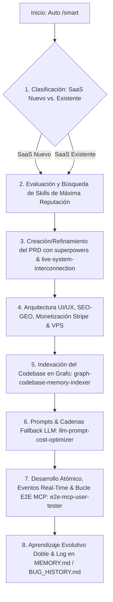

# 🤖 Master Skill: Smart Systems Builder (Orquestador Autónomo para SaaS)

> Esta Skill actúa como el **Cerebro Orquestador Autónomo** para el desarrollo y optimización de **Plataformas SaaS**. Se inicia automáticamente al instalarse en un proyecto o ejecutando el comando `/smart`. Clasifica el estado del proyecto (Nuevo o Existente), analiza el PRD o código actual, investiga e instala las habilidades mejor calificadas de la comunidad, indexa el codebase en grafos y ejecuta un desarrollo libre de fallos.

---

## ⚡ Activación e Instrucción `/smart`

* **Gatillo Automático:** Se ejecuta al iniciar una sesión de desarrollo o al instalar la skill en el repositorio.
* **Comando Slash:** Se puede invocar explícitamente en el chat enviando `/smart` o solicitando construir/mejorar una plataforma SaaS.

---

## 🔄 Flujo Lógico de Ejecución Automática

---

## 📋 Desglose Detallado del Flujo Operativo

### 🔍 Fase 1: Identificación Inteligente del Estado del Proyecto
El agente inspecciona el workspace activo para clasificar el estado:
* **Escenario A: SaaS Nuevo (Empty / Scaffold):**
  * Directorio vacío o solo con archivos de configuración inicial (`package.json`, `.gitignore`).
  * *Acción:* Iniciar flujo desde cero con creación de arquitectura SaaS, modelo de suscripciones y PRD desde el origen.
* **Escenario B: SaaS Existente (Refactor / Feature / Mejora):**
  * Código base existente, rutas API, componentes o base de datos en operación.
  * *Acción:* Analizar la arquitectura actual, consultar el Grafo de Conocimiento y refinar el PRD existente sin romper código funcional.

---

### ⭐ 🛡️ Fase 2: Inspección y Búsqueda de Skills de Alta Reputación (`rules-optimizer-evaluator` & `security-audit-sentinel`)
1. Analizar el PRD o código del proyecto SaaS para identificar necesidades tecnológicas.
2. Invocar **`rules-optimizer-evaluator`**:
   * Buscar en repositorios oficiales y comunidad las habilidades (skills) más reputadas, mejor calificadas y mantenidas.
   * Seleccionar las skills que aceleren y aseguren el desarrollo del SaaS.
3. Invocar **`security-audit-sentinel`** (Security Gate Obligatorio):
   * Auditar e inspeccionar la inocuidad de cada skill antes de descargarla o instalarla en el proyecto.
   * Validar permisos mínimos y cero vulnerabilidades OWASP.

---

### 📜 Fase 3: Generación o Refinamiento del PRD (`superpowers` & `live-system-interconnection`)
1. Invocar la skill **`superpowers`** (Metodología de 7 fases y TDD).
2. **Si es SaaS Nuevo:** Redactar un `PRD.md` exhaustivo con la arquitectura completa:
   * *Sección 1:* Visión del SaaS y Modelo de Negocio (Suscripciones, Paywalls, Tarjetas).
   * *Sección 2:* Arquitectura UI/UX (Bento Grid, Glassmorphism, accesibilidad A11y).
   * *Sección 3:* Criterios de Aceptación por Módulo (Auth, Billing, Dashboard, APIs).
   * *Sección 4:* Stack Tecnológico (Next.js App Router, TypeScript, PostgreSQL/pgvector, Stripe).
   * *Sección 5:* Desglose Atómico de Fases ("Una sola cosa a la vez").
3. **Si es SaaS Existente:** Invocar **`live-system-interconnection`** para auditar que los nuevos módulos se integren perfectamente con la base de datos y sistema de usuarios actual.

---

### 🎨 🚀 💳 Fase 4: Arquitectura UI/UX, SEO-GEO, Monetización & VPS
1. Invocar **`ui-ux-performance-architect`**:
   * Diseñar tokens de UI (Bento Grid, Glassmorphism, respuestas <100ms, accesibilidad A11y, estados Loading/Empty/Error/Success).
2. Invocar **`geo-seo-llmo-engine`**:
   * Inyectar esquema JSON-LD (`SoftwareApplication`, `Organization`, `FAQPage`).
   * Optimizar presencia RAG para recomendadores de IA (Gemini, Claude, ChatGPT, Perplexity).
3. Invocar **`monetization-stripe-billing-engine`**:
   * Configurar pasarelas de pago, suscripciones (Stripe / MercadoPago), paywalls y cobros por uso.
4. Invocar **`vps-docker-autodeployer`**:
   * Configurar contenedorización Docker, proxy inverso (Caddy/Nginx), SSL y auto-hosting en VPS propias.

---

### 🗺️ Fase 5: Indexación del Codebase en Grafo (`graph-codebase-memory-indexer`)
1. Invocar **`graph-codebase-memory-indexer`**:
   * Generar o actualizar `.agent/memory/ARCHITECTURE_GRAPH.md` mapeando componentes, endpoints API y esquemas de BD.
   * Garantizar ruteo directo de contexto para ahorrar hasta 20x de tokens por sesión.

---

### ✍️ 🤖 Fase 6: Prompts, Cadenas Fallback & Guardrails (`llm-prompt-cost-optimizer`)
1. Invocar **`llm-prompt-cost-optimizer`**:
   * Configurar cadenas de fallback gratis ($0 cost default), validación de JSON estricto Zod y latencia optimizada.

---

### 🔬 ⚡ Fase 7: Desarrollo Atómico, Eventos Real-Time y Bucle E2E MCP (`e2e-mcp-user-tester`, `realtime-websocket-webhook-engine`)
1. Invocar **`realtime-websocket-webhook-engine`**:
   * Configurar recepción idempotente de webhooks (`Idempotency-Key`), colas Redis/BullMQ y eventos WebSockets/SSE.
2. Tomar una sola tarea a la vez del `PRD.md`.
3. Implementar cambios quirúrgicos con pruebas TDD.
4. Invocar **`e2e-mcp-user-tester`**:
   * Ejecutar la prueba de usuario real usando MCP (DevTools / Navegador / API pings).
   * Si detecta fallas, aplicar arreglo quirúrgico y re-probar inmediatamente en bucle cerrado hasta pulir al 100%.

---

### 🧠 Fase 8: Aprendizaje Evolutivo Doble y Log en Memoria Global
1. Registrar bugs complejos resueltos en `BUG_HISTORY.md`.
2. Registrar aprendizajes arquitectónicos en `MEMORY.md`.
3. Actualizar el `AGENTS.md` local del repositorio para garantizar continuidad perfecta entre sesiones.
