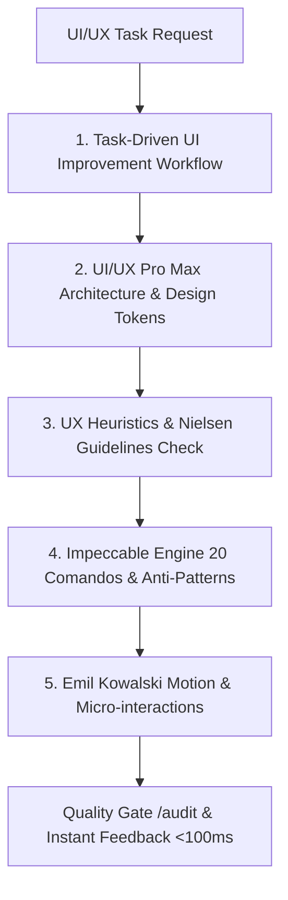

# 🎨 Master Skill: UI/UX, Motion & Performance Architect

> Esta skill se activa en cualquier etapa de diseño, prototipado o auditoría de interfaces frontend para garantizar productos de nivel industrial con estética de alta gama (Apple/Airbnb/Stripe), movimiento fluido (<300ms), arquitectura de tokens, accesibilidad WCAG 2.1 AA y cero estados sin salida.

---

## 🏛️ Los 5 Motores Integrados de la Skill

1. **🎯 Task-Driven UI Improvement Engine:** Flujo orientado a completar las tareas del usuario con claridad absoluta, reduciendo la fricción y eliminado estados ambiguos o sin salida.
2. **✨ UI/UX Pro Max Architecture:** Estructura modular Bento Grid, Glassmorphic UI sutil, Kinetic Typography, colores tintados en OKLCH y matriz obligatoria de 8 estados por componente (Default, Hover, Focus, Active, Disabled, Loading, Empty, Error, Success).
3. **🧠 UX Heuristics & Guidelines (Jakob Nielsen + Leyes UX):** Aplicación de las 10 Heurísticas de Nielsen, Ley de Fitts ($44 \times 44\text{px}$ touch targets), Ley de Hick, Principios Gestalt y Accesibilidad WCAG 2.1 AA.
4. **💎 Impeccable Design Engine (20 Comandos & Anti-Patrones):** Comandos de iteración (`/audit`, `/critique`, `/polish`, `/typeset`, `/layout`, `/colorize`, `/animate`, `/bolder`, `/quieter`, `/distill`, etc.) y auditoría estricta contra 58 anti-patrones de diseño.
5. **🎬 Emil Kowalski Motion & Micro-interactions:** Animaciones físicas con resortes, easing `cubic-bezier(0.16, 1, 0.3, 1)`, duraciones snappies `<300ms`, optimización de GPU (`transform`/`opacity`) y soporte estricto para `prefers-reduced-motion`.

---

## 🛠️ Comandos de Iteración Rápidos (Impeccable Commands)

Puedes invocar o ejecutar estos comandos mentales para aplicar refinamientos quirúrgicos:

| Comando | Acción Principal | Impacto en Interfaz |
|---|---|---|
| **`/audit`** | Auditoría técnica integral | Verifica accesibilidad, rendimiento, contrastes y layout |
| **`/critique`** | Revisión UX & Jerarquía | Analiza el ancla visual única, flujo de lectura y fricción |
| **`/polish`** | Refinamiento de precisión | Ajusta radios, bordes semitransparentes y alineación de 8px |
| **`/typeset`** | Escala Tipográfica Fluida | Aplica escala modular, ritmos verticales y tipografías cinéticas |
| **`/colorize`** | Paleta OKLCH Tintada | Sustituye negros puros por neutros tintados y regla 60-30-10 |
| **`/layout`** | Reestructuración Spatial | Aplica grilla base de 8px, elimina tarjetas anidadas y maqueta en Bento Grid |
| **`/animate`** | Inyección de Movimiento | Aplica principios de Emil Kowalski (<300ms, GPU transform/opacity) |
| **`/bolder`** | Inyección de Personalidad | Aumenta contraste, peso tipográfico y acentos de marca |
| **`/quieter`** | Reducción de Ruido Visual | Baja saturaciones, suaviza bordes y simplifica elementos secundarios |
| **`/distill`** | Purificación Minimalista | Elimina elementos redundantes dejando solo lo esencial para la tarea |

---

## 📐 Reglas Estrictas de Código y Construcción UI

### 1. Tipografía & Jerarquía
* **Prohibido:** Usar fuentes por defecto sin intención (Inter/Arial estándar) o tamaños en `px` arbitrarios fuera de la escala modular.
* **Obligatorio:** Tipografías modernas (Outfit, Plus Jakarta Sans, Geist, DM Sans). Altura de línea ajustada (`line-height: 1.1-1.2` para encabezados, `1.5-1.6` para párrafos).

### 2. Color & Profundidad
* **Prohibido:** Negro puro (`#000000`) o grises planos sin tinte.
* **Obligatorio:** Neutros tintados en espacio OKLCH o HSL. Modo oscuro estructurado por niveles de elevación de luminosidad (no solo sombras negras).

### 3. Espaciado & Maquetación
* **Prohibido:** Card inside Card (tarjetas anidadas), paddings arbitrarios como `13px` o `27px`.
* **Obligatorio:** Grilla base basada en múltiplos de 8px (`8px`, `16px`, `24px`, `32px`, `48px`). Estructura visual con una sola ancla focal visual por vista.

### 4. Micro-interacciones & Animaciones (Emil Kowalski Rules)
* **Prohibido:** Animaciones de más de `300ms`, rebotes exagerados o animar propiedades de layout como `height`/`width`/`margin` que provoquen repintado.
* **Obligatorio:** Easing `ease-out` o `cubic-bezier(0.16, 1, 0.3, 1)`, animar solo `transform` y `opacity`. Respetar siempre `prefers-reduced-motion`.

---

## 📚 Referencias Especializadas

Para consultar el desglose completo de cada módulo, revisa los archivos de referencia incluidos en esta skill:
* 🎬 [Guía de Movimiento y Animaciones de Emil Kowalski](file:///C:/proyectospro/saas-smart-engine/skills/ui-ux-performance-architect/references/emil_kowalski_motion.md)
* 💎 [Catálogo de 20 Comandos e Impeccable Anti-Patterns](file:///C:/proyectospro/saas-smart-engine/skills/ui-ux-performance-architect/references/impeccable_commands_rules.md)
* 🧠 [Heurísticas de Usabilidad de Nielsen & UX Guidelines](file:///C:/proyectospro/saas-smart-engine/skills/ui-ux-performance-architect/references/ux_heuristics_guidelines.md)

---

## ✅ Quality Gate `/audit` (Certificación Pre-Shipping)

Antes de dar una interfaz o componente por finalizado, verifica:
- [ ] **Feedback Instantáneo (<100ms):** Cualquier clic o interacción tiene respuesta visual sutil inmediata.
- [ ] **8 Estados del Componente:** Cobertura de Default, Hover, Focus, Active, Disabled, Loading (skeletons), Empty, Error y Success.
- [ ] **Accesibilidad WCAG 2.1 AA:** Contraste $\ge 4.5:1$, navegación por teclado limpia (`focus-visible`), etiquetas `aria-label`.
- [ ] **Movimiento Fluido:** Animaciones de $<300ms$, optimizadas para GPU y sin Layout Shift (CLS=0).
- [ ] **Estética 9.5/10:** Visualmente impactante, Bento Grid modular, armónica y libre de anti-patrones.
