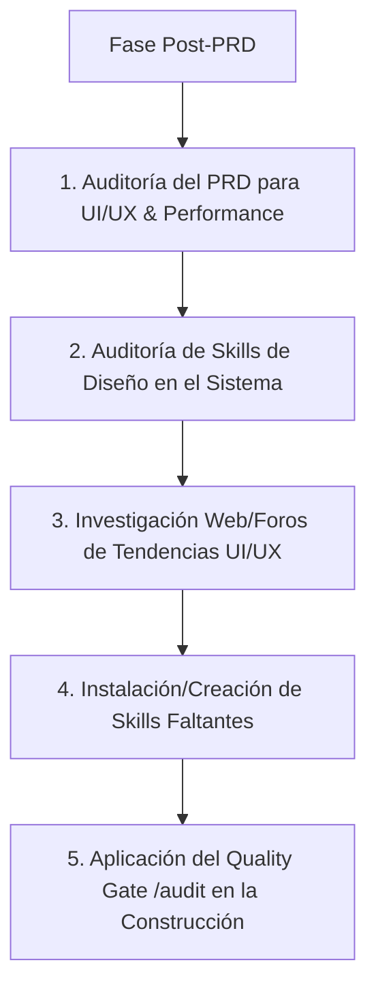

# 🎨 Skill: UI/UX & Performance Architect (Arquitecto de Experiencia, Rapidez y Estabilidad)

> Esta Skill actúa inmediatamente después de la fase de PRD para diseñar y verificar la interfaz de usuario, velocidad de carga y estabilidad del sistema. Investiga en la web/comunidades las mejores prácticas de UI/UX, audita las skills disponibles e instala/crea las habilidades de diseño que falten en el sistema.

---

## 🎯 Pilares del Diseño y Rendimiento

1. **⚡ Rapidez Extrema (Performance First):** Carga inicial ultra rápida, bundle optimizado, renderizado eficiente y respuesta al usuario en <100ms.
2. **🛡️ Estabilidad & Cero Crash:** Manejo de estados (Cargando, Vacío, Error, Éxito), prevención de layout shifts (CLS=0) y manejo robusto de excepciones en UI.
3. **✨ UI/UX Nivel Premium (Apple/Airbnb/Stripe):** Bento Grid modular, Glassmorphism sutil, Kinetic Typography, micro-animaciones fluidas y soporte modo oscuro/claro elegante.
4. **♿ Accesibilidad Total:** Cumplimiento de estándares accesibles (`aria-label`, `tabindex`, `role`, navegación por teclado).

---

## 🔄 Protocolo de Ejecución de la Skill

### Paso 1: Análisis Post-PRD para Diseño y Estabilidad
1. Analizar el `PRD.md` o `specs/PRD.md` recién construido.
2. Extraer la lista de pantallas, modales, componentes interactivos, APIs de datos y requisitos de respuesta.
3. Definir el **Sistema de Design Tokens**:
   * Paleta de colores tailoreada (gradients, dark mode, accent colors).
   * Tipografía moderna (Inter, Outfit, Roboto via Google Fonts).
   * Micro-interacciones (hover, active, transiciones <200ms).

### Paso 2: Auditoría de Skills del Sistema
1. Revisar la biblioteca de skills en `C:\Users\Erick Diaz\.gemini\config\skills`.
2. Verificar la presencia de las skills de diseño, rendimiento y estabilidad:
   * `web-performance-optimization` (Optimización de velocidad y Web Vitals).
   * `nextjs-best-practices` & `react-patterns` (Patrones de componentes y renderizado).
   * `cc-skill-coding-standards` (Accesibilidad y estándares).

### Paso 3: Investigación Web & Redes de Tendencias UI/UX
1. Buscar en foros de desarrolladores, GitHub, X (Twitter) y comunidades de UI/UX sobre:
   * Diseños Bento Grid modernos y componentes reactivos.
   * Micro-animaciones en React/Next.js y patrones de diseño Stripe/Airbnb.
   * Estrategias de caching, prevención de rerenders e instant feedback.
2. Extraer plantillas de componentes, tokens CSS y patrones de estabilidad.

### Paso 4: Auto-instalación o Creación de Skills de Diseño Faltantes
1. Si el sistema carece de una skill específica de diseño o animación (ej: `micro-interactions-design`, `bento-grid-layouts`), crear o instalar la skill en `C:\Users\Erick Diaz\.gemini\config\skills\`.
2. Registrar la nueva skill en el catálogo global del sistema.

### Paso 5: Certificación y Quality Gate (`/audit`)
Durante la construcción del proyecto, forzar la validación de cada componente según los criterios:
* [ ] **Respuesta <100ms:** Feedback visual inmediato al hacer clic o interactuar.
* [ ] **Estados Obligatorios:** Cobertura total de estados Loading, Empty, Error y Success.
* [ ] **Accesibilidad Completa:** Atributos `aria-label`, contraste adecuado y navegabilidad por teclado.
* [ ] **Estética 9/10:** Visualmente impactante, sin elementos genéricos ni colores planos por defecto.
